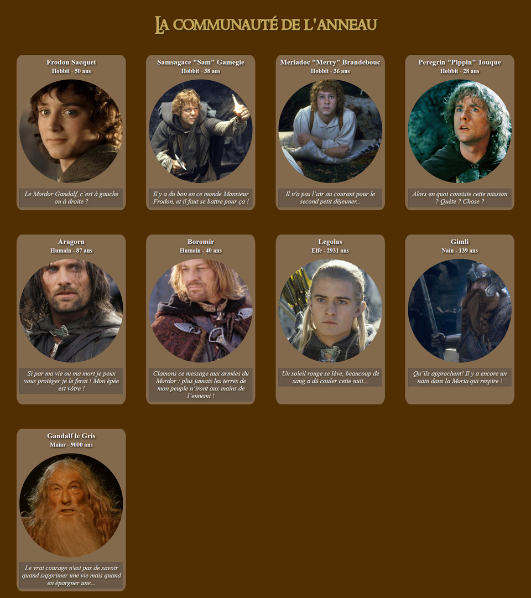
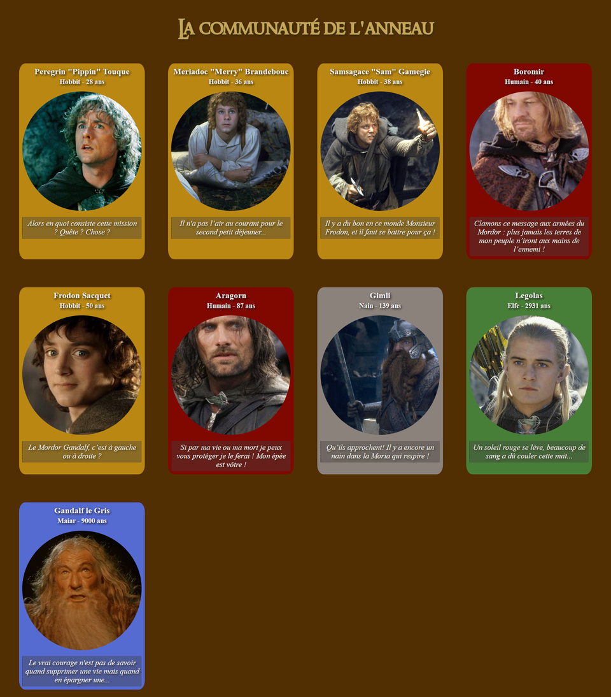

# Exercice 1 : Algo

## La communauté de l'anneau


Peter Jackson soutaite ressortir une version améliorée et restaurée du _Seigneur des Anneaux_ en profitant des dernières technologies. Il compte sur vous pour réaliser le site promotionnel !

Son équipe a déjà réalisé un squellete de l'architecture ainsi qu'un tableau reprenant différents personnages. Il ne veut pas que l'on modifie ce tableau !

### Architecture du site

```
|- assets (éléments utilisés dans le site)
| |- css
| |- fonts
| |- img
|- common (includes php)
| |- footer.php
| |- header.php
|- php (tableau avec les personnages)
| |- array-fellowship.php
|-character-list.php
```

Pour importer des includes:

```php
include("relative-path/my-file.php");
```

Pour importer des fichiers PHP / Classes, via _require_:

```php
require("relative-path/my-file.php");
require_once("relative-path/my-file.php");
```

- _include_ : l'expression de langage include inclut et exécute le fichier spécifié en argument. En cas d'erreur dans le script, PHP émettra des warnings. Les includes sont souvent utilisés pour les templates.
- _require_ : identique à include mis à part le fait que lorsqu'une erreur survient, le script sera stoppé.
- _require_once_ : identique à require mis à part que PHP vérifie si le fichier a déjà été inclus, et si c'est le cas, ne l'inclut pas une deuxième fois.

### Exercice, partie 1

Le fichier _php/array-fellowship.php_ contient un tableau avec une liste de personnages et leurs caractéristiques. Chaque personnage étant lui même contenu dans un tableau associatif.

Exemple:

```php
  $fellowshipList["Legolas"] =  [
    "nom" => "Legolas",
    "citation" => "Un soleil rouge se lève, beaucoup de sang a dû couler cette nuit...",
    "age" => 2931,
    "origine" => "Elfe",
    "url-img" => "legolas.jpg"
  ];
```

Le but est d'afficher une carte pour chaque personnage avec ses caractéristique:

- Nom
- Origine + âge
- Photo
- Citation

Voici un exemple de carte:


**Il s'agit pour vous de trouver un moyen d'afficher tous les personnages contenu dans le tableau sur une page web, en mettant le tout en page...**

Ce n'est pas obligatoire de faire exactement comme sur la maquette, l'idée est surtout d'afficher tous les persos, chacun avec ses données.

Voici une idée de ce que pourrait donner le résultat final :



### Exercice, partie 2

Ajoutons deux petits challenges.

**Challenge 1** : Trouver le moyen d'afficher les personnages par âge, du plus jeune (Pippin) au plus âgé (Gandalf).

**Challenge 2** : Adapter le fond de couleur des cartes en fonction de l'origine des personnages.

- Humains : rouge
- Hobbits: orange
- Elfes : vert
- Nains : gris
- Maiars : bleu



## Liens utiles

### PHP

- [include](https://www.php.net/manual/fr/function.include.php)
- [require](https://www.php.net/manual/fr/function.require.php)
- [require_once](https://www.php.net/manual/fr/function.require-once.php)
- [Comment trier un tableau de tableaux associatifs par valeur d’une clé donnée en PHP ?](https://fr.acervolima.com/comment-trier-un-tableau-de-tableaux-associatifs-par-valeur-d-une-cle-donnee-en-php/)

### CSS

- [How to Center an Image Vertically and Horizontally with CSS](https://www.freecodecamp.org/news/how-to-center-an-image-in-css/)
- [How to Create an Image Gallery with CSS Grid Layout](https://www.imarketinx.de/artikel/responsive-image-gallery-with-css-grid.html)
- [Image Captions with CSS Flexbox](https://www.imarketinx.de/artikel/text-centered-on-image.html)
- [Flex: minmax()](<https://developer.mozilla.org/fr/docs/Web/CSS/minmax()>)
