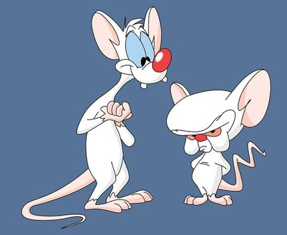
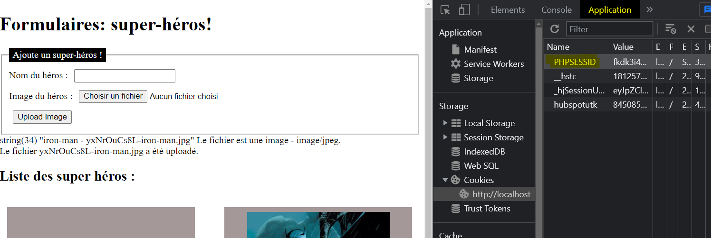

# Exercice 3 : Sessions

## Activez une session !

Minus a cassé le programme de fichage des ennemis susceptibles de contrecarer les plan de conquête du monde de Cortex!

Réparez-le en introduisant la gestion des sessions!

Astuces :

- Il faudra démarrer une session
- Il faudra modifier le code à plusieurs endroits: notamment vérifier si la session existe lorsqu'on affiche les personnages, dans le cas contraire proposer un tableau prérempli avec _Batman_ et _Spiderman_.
- Egalement, il faudra que lorsqu'on ajoute un personnage, il soit ajouté dans le tableau contenu dans le cookie.

Pour remettre la session à zéro, pensez à effacer le cookie depuis votre navigateur.

Pensez à nettoyer votre répertoire upload car au fur et à mesure des essais, le dossier sera rempli d'images!

## Liens utiles

- [PHP File Upload](https://www.w3schools.com/php/php_file_upload.asp)
- [Comment générer une chaîne de caractères (string) aléatoire (random) en PHP ?](https://www.journaldunet.fr/web-tech/developpement/1202443-comment-generer-une-chaine-de-caracteres-string-aleatoire-random-en-php/)
