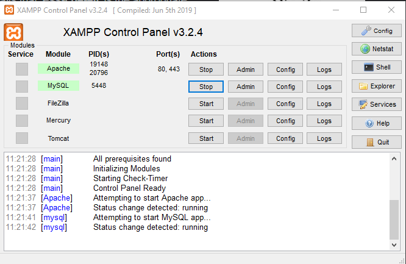
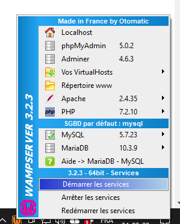
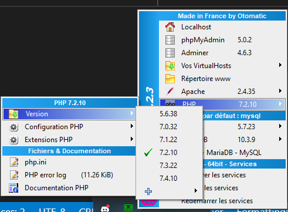
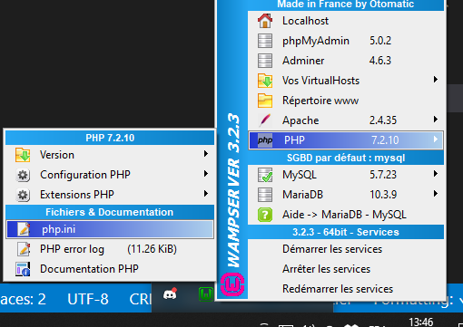
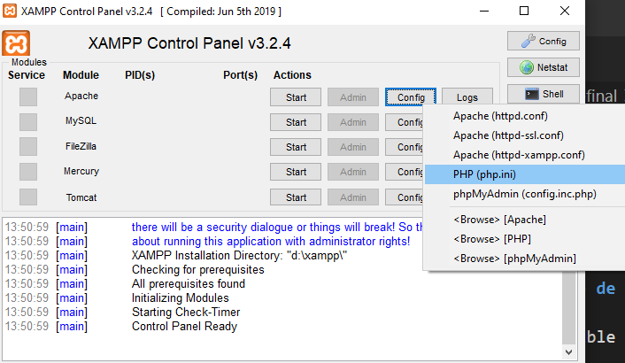

# PROFORMA - INTROPROG 2022a


_Février / Mars 2022_

> 🔨 Bienvenue sur le Github du cours PHP de la formation Introprog.
> Vous trouverez ici les ressources nécessaires pour le suivi du cours: théorie,
> exercices (et corrigés), slides...
> Le repo sera alimenté tout au long de la formation, n'hésitez pas à y revenir souvent!
>
> Votre formateur, Vincent Chilot

---

## Programme

Lors de nos sessions, nous aborderons les matières suivantes, de façon théorique et pratique.

### PHP (5 jours)

- Intro à PHP (PHP qu'est-ce que c'est, sites statiques vs dynamiques...)
- Algorithmique (boucle, conditions...)
- Les formulaires (get, post...)
- Les sessions en PHP
- Intéragir avec une base de données avec PDO (PHP Data Objects)
- L'architecture MVC (Modèle vue contrôleur)

### PHP Labo (4 jours)

Quatre jours durant lesquels vous mettrez vos connaissances à profit pour réaliser une application
en PHP (CRUD).

### Javascript (1,5 jours)

Il y aura également 1 jour et demi consacré au Javascript.

### S'il reste du temps

- Github et Git
- La POO en PHP (programmation orientée objet)

## Github

### Que sont Github et Git?

Github est un service web d'hébergement et de gestion de développement de logiciels, utilisant
le logiciel de gestion de versions Git, créé par Linus Torvalds, auteur du noyau Linux.

Git permet de faire du versioning lors des développements, de faire du travail collaboratif
ou de partager des ressources, comme cela sera fait lors de la formation.

Un espace de travail dans Git s'appelle un repository (repo).

La mascotte de Github est "Octocat".


### Comment cloner un repository Github ?

Il y a plusieurs façons de faire, mais la plus simple est de cliquer sur l'onglet "Code" et de choisir "Download ZIP".


Vous aurez ainsi téléchargé un zip contenant tout le contenu de ce repo Github.

**ATTENTION** : durant la formation, veillez à éviter d'écraser votre travail lorsque vous copierez
les dossiers du zip.

## Environnement de travail

PHP est un langage dynamique. Ouvrir un fichier ".php" dans un navigateur aura pour résultat
de n'afficher que le code source ou un message d'erreur.

Pour travailler avec PHP, il y a plusieurs conditions:

- Avoir PHP installé sur sa machine.
- Avoir un serveur qui tourne en arrière plan (Apache, Nginx...).
- Ce n'est pas obligatoire, mais si on veut utiliser une base de données il faut un système de gestion de bases de données: MySQL (MariaDB), PostgreSQL...

Heureusement, certains outils permettent de simplifier l'installation en proposant un package "tout en un" (PHP, Apache, MySQL ou MariaDB) avec également l'excellent outil PhpMyAdmin pour administrer les bases de données.

Lors de la formation, nous utiliserons **PHP 7.4**.

_Fun facts_:

- Nginx se prononce "engine-ex".
- SQL se prononce "Ess-cue-ell", mais certains anglophones prononcent "sequel".

### XAMPP (Windows, Mac et Linux)

_XAMPP est une distribution Apache entièrement gratuite et facile à installer contenant MySQL, PHP et Perl. Le paquetage open source XAMPP a été mis au point pour être incroyablement facile à installer et à utiliser._

En effet, il n'y a qu'à dézipper le dossier, lancer l'installateur et sélectionner un dossier de destination et le tour est joué. Il n'y a plus qu'à lancer la console de contrôle depuis le répertoire où a été installé XAMPP.



XAMPP existe pour Windows, Mac et Linux.

- [Téléchargement XAMPP pour PHP 7.4.27 - Tous supports](https://www.apachefriends.org/fr/download.html)
- [Téléchargement XAMPP pour PHP 8.1.2 - Tous supports](https://www.apachefriends.org/fr/index.html)

### Wampserver (Windows)

_WampServer est une plate-forme de développement Web sous Windows pour des applications Web dynamiques à l’aide du serveur Apache2, du langage de scripts PHP et d’une base de données MySQL. Il possède également PHPMyAdmin pour gérer plus facilement vos bases de données._

Wampserver est plus "touchy" à installer et n'existe que sous Windows. Mais il a l'avantage de proposer plusieurs versions de PHP que l'on peut sélectionner. On peut également choisir d'utiliser Adminer ou PHPMyAdmin, My SQL ou MariaDB.

_Note_: il n'est pas obligatoire de remplir le formulaire lors du téléchargement, on peut cliquer sur "lien direct".



Pour choisir sa version de PHP:

_PHP / Version_



- [Téléchargement Wampserver pour PHP 5.6.40 /7.4.26 /8.0.13 /8.1.0 - Windows](https://www.apachefriends.org/fr/index.html)

### Mamp (Windows / Mac)

Wampserver n'existant pas sous Mac, il est possible d'utiliser Mamp à la place.

Attention qu'il s'agit d'un logiciel propriétaire. La version gratuite ne permet que de choisir une seule version de PHP et un seul serveur.

C'est suffisant pour la formation et pour la plupart des situations, il faudra veiller à sélectionner Apache et PHP 7.4 lors de l'installation.

_Note_ : Pour que MAMP fonctionne, il faut le placer dans votre dossier Application.
De même les fichiers PHP doivent être mis à l'adresse suivante:
_/Applications/MAMP/htdocs_

- [Téléchargement Mamp - Mac](https://www.mamp.info/en/mac/?m=1629109578&)

### Tester l'environnement

Une fois l'application installée, il suffit de lancer les services.

Puis vous pourrez accéder aux pages suivantes:

- [Homepage par défaut](http://localhost/) : http://localhost/
- [PHPMyAdmin](http://localhost/phpmyadmin/) : http://localhost/phpmyadmin/

Selon l'outil choisi, les fichiers et applications PHP se trouveront dans:

- Wamp: _/wamp64/www/_
- Xamp: _/xampp/htdocs/_
- Mamp: _applications/Mamp/htdocs/_

C'est à cet endroit que vous mettrez vos dossiers avec vos applications PHP.

Exemple:

_htdocs/mon-application/ma-page.php_

Sera accessible via: http://localhost/mon-application/ma-page.php

A noter que si vous nommez votre fichier ".php": "index.php", la page s'ouvrira dès que vouse entrerez l'url dans le naviagateur. Sinon il sera possible de naviguer dans l'arborescence de votre site / application.

### Problème de cache ou de refresh?

Il est possible que vous deviez modifier le fichier "php.ini".





Remplacer:

```
;opcache.revalidate_freq=2
;opcache.enable=1
```

Par:

```
opcache.enable=0
opcache.revalidate_freq=0
```

Notez qu'il faut enlever le ";" avant

## Liens utiles / Ressources externes

### PHP

- [PHP.NET](https://www.php.net/)
- [Les Conventions de nommage et d’écriture de code](https://donkey.school/blog/les-conventions-de-nommage-et-decriture-de-code/)

### Outils / Frameworks PHP / CMS

- [Composer - A Dependency Manager for PHP](https://getcomposer.org/)
- [Symfony, High Performance PHP Framework](https://symfony.com/)
- [Laravel - The PHP Framework For Web Artisans](https://laravel.com/)
- [WordPress](https://fr-be.wordpress.org/)
- [Drupal - Open Source CMS](https://www.drupal.org/)

### Tutoriels

- [OpenClassRoom - Concevez votre site web avec PHP et MySQL](https://openclassrooms.com/fr/courses/918836-concevez-votre-site-web-avec-php-et-mysql)
- [grafikart.fr - Apprendre PHP](https://grafikart.fr/tutoriels/php)

## About Me

**Vincent Chilot**(Raigyo), Développeur Web

- [Github](https://github.com/Raigyo)
- [Portfolio](https://raigyo-dev.be/)
- [LinkedIn](https://www.linkedin.com/in/vincent-chilot/)


